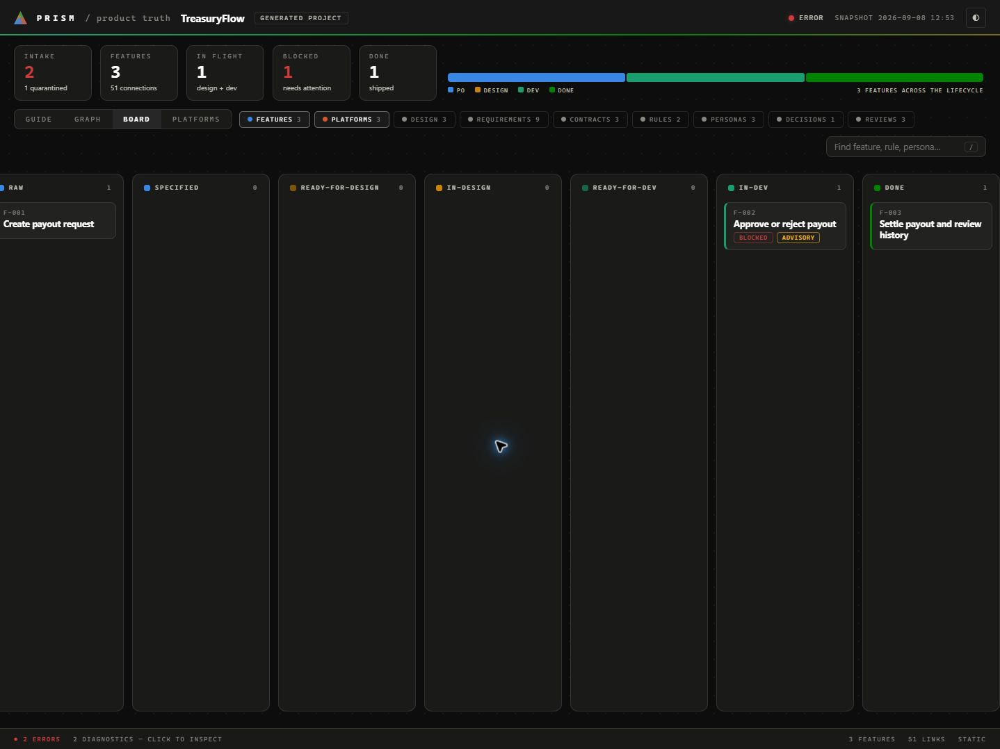
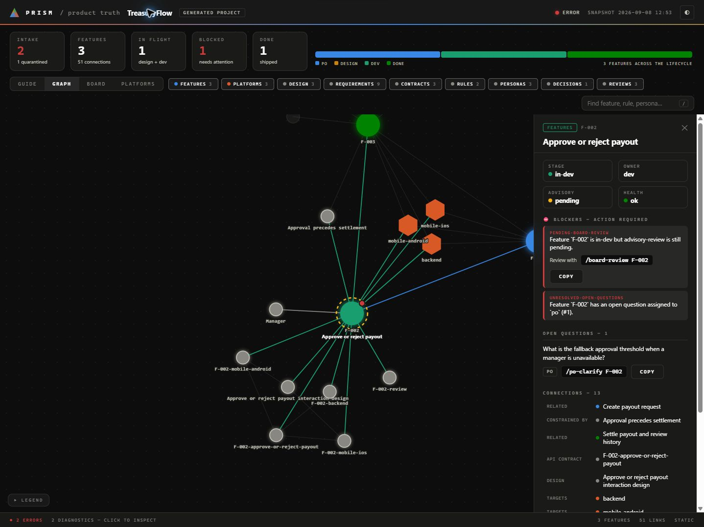
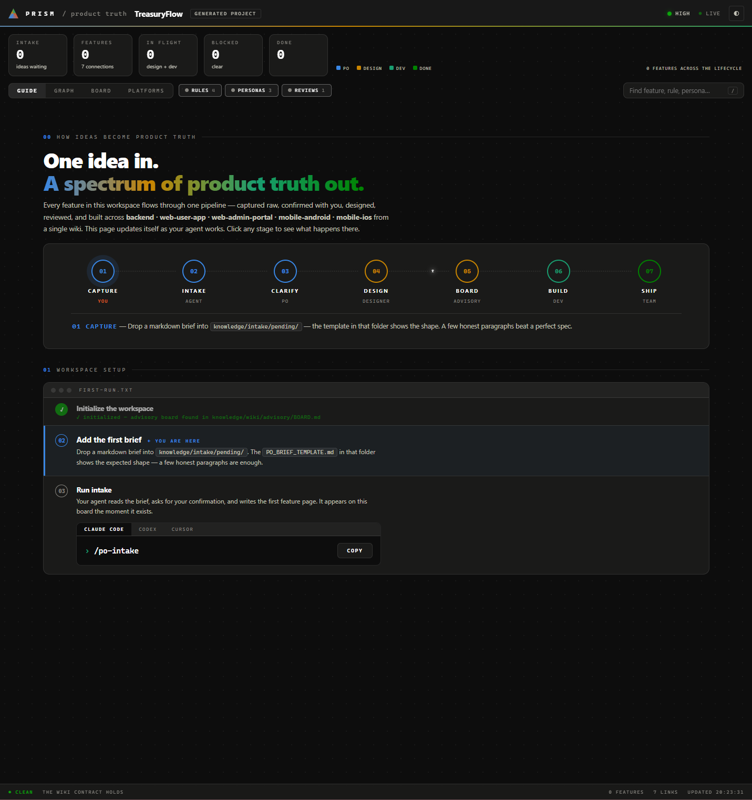

# Generated Projects

Generated Prism repositories include more than application code.

They also include:

- project documentation
- AI context for multiple tools
- the product wiki and lifecycle wiring
- generators and workflow scaffolding inside the generated repo

This page answers two questions:

1. what do I have after Prism generation?
2. how do I work inside the generated project?

## What You Get

Generated projects include:

- a generated `README.md` with the human overview, setup and the operation names by tool
- a required `knowledge/` tree with raw intake and the living product wiki
- platform-specific docs under `docs/`, `backend/docs/`, `mobile-android/docs/`,
  `mobile-ios/docs/`, `web-user-app/docs/`, and `web-admin-portal/docs/`
- a generated `AGENTS.md`, the single source of agent rules, and a `CLAUDE.md` that only imports it with `@AGENTS.md`; each platform folder repeats the pattern
- Cursor rules under `.cursor/rules/`: `project.mdc` references `@AGENTS.md` and the other rules scope stack facts by file path
- GitHub workflow files that build and test; they hold no deploy job and no secrets
- Hygen generators under `_templates/`
- a `docker-compose.yml` with the PostgreSQL development database when a backend app is selected
- a `deployment` skill in `.claude/skills/deployment/` and `.agents/skills/deployment/` with worked
  examples for the backend on Azure Container Apps and the web apps on Cloudflare Workers; hosting,
  secrets and deployment belong to the user and their agent

Treat those outputs as part of the product, not as disposable scaffolding.

## First-Time Use

The first-run path lives in [getting-started.md](getting-started.md).

What matters here is the generated-project operating model:

- the repository already contains the wiki skeleton
- `setup-project` initializes the project-specific advisory board state
- after that, the read/query layer and lifecycle commands become the main way you work with Prism

Initialize the wiki with:

- Claude Code: `/setup-project`
- Codex: `$setup-project`
- Cursor: ask the agent to run `setup-project`

That setup flow creates the advisory board in `knowledge/wiki/advisory/BOARD.md` and
prepares the wiki for `po-intake`, `design-intake`, and the rest of the lifecycle.

## Dashboard View

Generated projects can be explored through the wiki graph dashboard:

- `prism wiki graph --open` opens the interactive dashboard in the browser
- `prism wiki graph --serve` keeps it live-updating as wiki files change

The dashboard is derived from the wiki and stays read-only. Its Graph, Board,
Apps, and Guide views are meant for orientation: feature counts, lifecycle
state, intake visibility, graph relationships, app requirements, and
first-run guidance before the wiki has been initialized. Confidence and source
paths remain visible so a stale or malformed source can be inspected before it
informs a workflow decision.

The shared board that `prism board serve` provides shows the same views and adds direct
human actions (`po-handoff`, `design-start` and `dev-start`) plus an MCP endpoint for
agents. A generated project activates it with `prism workflow upgrade . --apply`; see
[shared-board.md](shared-board.md).

A generated project's `prism.workspace.yml` declares the platforms you selected as apps, with
the IDs `backend`, `web-user-app`, `web-admin-portal`, `mobile-android` and `mobile-ios`, all
in this repository. `prism status` lists them, and `prism app add` registers another app, in
this repository or in another one, without generating code. A machine that keeps an external
repository's checkout records it in `prism.local.yml`, which the generated `.gitignore`
excludes. [workspace-model.md](workspace-model.md) describes the manifest.

For a repeatable local capture, use the [wiki visualization guide](wiki-visualization.md),
which builds a synthetic TreasuryFlow fixture in a new destination. The
fixture demonstrates fresh, intake, and populated stages; it contains no
production data or observed project history.







## How To Read The Generated Repo

The most important generated areas are:

- root `README.md` for the generated repo overview
- root `AGENTS.md` for AI orientation and the rules every agent follows
- `knowledge/intake/` for raw human input and workflow state
- `knowledge/wiki/` for structured product knowledge
- platform-specific docs and source trees for implementation

If you are trying to understand the product state, the wiki matters more than the code
tree.

If you are trying to understand the generated implementation surface, read the generated
docs and platform slices together.

If the generated project includes the backend, the first successful local startup usually
looks like this:

- start only the database container with `docker compose up -d db`
- run the backend locally with the `local` Spring profile
- in IntelliJ IDEA, configure the backend run to activate the `local` Spring profile,
  either through a run configuration or the active profiles field

## AI Agent Surfaces

Generated projects include agent context for Claude, Codex, and Cursor.

Invocation model:

- Claude Code uses slash commands under `.claude/commands/`
- Codex uses skills under `.agents/skills/` and invokes the structured workflow surface
  with a `$` prefix
- Cursor users ask the agent to run the same named operations

Workspace recommendation:

- Open the **generated repository root** when using Claude Code or Codex.
- Root AI context and skill surfaces live at the generated repo root, not inside
  platform subfolders such as `mobile-android/` or `mobile-ios/`.
- If you open only a platform subfolder as a standalone workspace, do not assume the
  agent will automatically discover parent-level skills or root guidance.
- In that narrower setup, manually inspect the generated repo root files such as
  `README.md`, `AGENTS.md`, `CLAUDE.md`, `.agents/skills/`, and
  `.claude/skills/` when they are available.

For the broader model behind these surfaces, see:

- [prism-model.md](prism-model.md)
- [wiki-workflow.md](wiki-workflow.md)
- [ai-surfaces.md](ai-surfaces.md)

## What Is Safe To Run First

The most important operational distinction is:

- some commands are read-oriented and safe for navigation
- some are review tools that may write reports or logs without changing lifecycle state
- others change lifecycle or wiki state

Start with the read-oriented layer first, then use the review tools when you want explicit
health or audit output.

Cursor does not use the same slash or `$` invocation syntax. In practice, Cursor users ask
the agent to run the same named operation.

### Orient / read-only

| Role | Claude Code | Codex | Purpose |
|------|-------------|-------|---------|
| Dev | `/prep-sprint` | `$prep-sprint` | Show what is ready to build |
| Shared | `/feature-status` | `$feature-status` | Full pipeline view and refresh of the generated orientation report |
| Shared | `/wiki-show F-XXX` | `$wiki-show F-XXX` | Assemble focused feature context from linked wiki files |
| Shared | `/wiki-blockers` | `$wiki-blockers` | Show blockers using the canonical blocker categories |
| Shared | `/wiki-query "text"` | `$wiki-query "text"` | Retrieval-assisted search across the wiki |
| Shared | `/wiki-owner po\|designer\|dev\|none` | `$wiki-owner po\|designer\|dev\|none` | Show pending work and stale pages (last verification older than `wiki-stale-after-days`) for one owner role |
| Shared | `/verify-pages <page>...` | `$verify-pages <page>...` | Record that current-state pages were checked against their sources: one `verify` entry in `log.md`, no page edited |
| Shared | `/wiki-app <app-id>` | `$wiki-app <app-id>` | Show the active feature queue for one app |

Recommended first use:

1. `feature-status`
2. `prep-sprint` if you are a developer
3. `wiki-show` or `wiki-query` for focused drill-down

### Lifecycle / write

| Role | Claude Code | Codex | Purpose |
|------|-------------|-------|---------|
| Shared | `/setup-project` | `$setup-project` | One-time project initialization that interviews you and builds the advisory board |
| PO | `/po-intake [folder]` | `$po-intake [folder]` | Process raw PO notes into `raw` feature pages |
| Shared | `/ingest [folder]` | `$ingest [folder]` | Process a pending folder, for any role, into a topic, research page, plan, direction, roadmap, persona, business rule, decision or feature |
| PO | `/po-clarify` | `$po-clarify` | Answer open questions assigned to PO |
| PO | `/po-specify [F-XXX]` | `$po-specify [F-XXX]` | Complete a `raw` feature and move it to `specified` |
| PO | `/po-handoff [F-XXX]` | `$po-handoff [F-XXX]` | Hand off a feature to design |
| Designer | `/design-intake [F-XXX] [folder]` | `$design-intake [F-XXX] [folder]` | Attach design artifacts to a feature |
| Designer | `/design-clarify` | `$design-clarify` | Answer open design questions |
| Designer | `/design-start [F-XXX]` | `$design-start [F-XXX]` | Start design on a feature that was handed off |
| Designer | `/design-handoff [F-XXX]` | `$design-handoff [F-XXX]` | Hand off a feature to dev |
| Dev | `/dev-clarify` | `$dev-clarify` | Answer open questions assigned to Dev |
| Dev | `/dev-start [F-XXX]` | `$dev-start [F-XXX]` | Start development on a feature that is ready for dev |
| Dev | `/dev-done [F-XXX]` | `$dev-done [F-XXX]` | Mark a feature as shipped, recording the delivery evidence the developer supplies |
| Shared | `/feature-reopen [F-XXX] [specified\|in-design\|in-dev]` | `$feature-reopen [F-XXX] [specified\|in-design\|in-dev]` | Reopen shipped work through one impact-reviewed route |
| Shared | `/ask [F-XXX] "q" --to po\|designer\|dev` | `$ask [F-XXX] "q" --to po\|designer\|dev` | Route a question to a role |

Use these only when you are intentionally changing project state.

### Audit / review

| Role | Claude Code | Codex | Purpose |
|------|-------------|-------|---------|
| Shared | `/lint-wiki` | `$lint-wiki` | Health-check the knowledge base; writes a lint report only when you ask for one |
| Board | `/board-review [F-XXX]` | `$board-review [F-XXX]` | Domain expert review before dev starts |
| Shared | `/audit-feature [F-XXX]` | `$audit-feature [F-XXX]` | Cross-check spec vs. source intake |

### API and contract workflow

For feature work in generated projects, keep the layers distinct:

- the wiki defines what to build
- `shared/api-contracts/openapi.yml` defines the API contract
- `task generate-clients` regenerates derived client code from that contract
- backend, mobile, and web code then implement or consume the contract

For endpoint changes, the default order is:

1. update the OpenAPI contract
2. run `task generate-clients`
3. implement the backend and downstream consumers

### Coding utilities

| Role | Claude Code | Codex | Purpose |
|------|-------------|-------|---------|
| Dev | `/add-endpoint` | backend-scoped `$endpoint` | Add an API endpoint with a contract-first workflow and update backend scaffolding |
| Shared | `/generate-clients` | `$generate-clients` | Regenerate platform clients after OpenAPI changes |
| Backend | `/document-entity` | backend-scoped `$document-entity` | Create or refine backend entity documentation |

## What The Wiki Adds

Generated projects are different from a plain code scaffold because the wiki is part of
the operating model.

Important wiki artifacts include:

- `knowledge/wiki/SCHEMA.md`
- `knowledge/wiki/LIFECYCLE.md`
- `knowledge/wiki/SETTINGS.md`
- `knowledge/wiki/WIKI_REPORT.md` once `feature-status` has generated it
- `knowledge/wiki/features/`
- `knowledge/wiki/app-requirements/`
- `knowledge/wiki/index.md`, which also lists the pages of `docs/` under "Project docs"
- `knowledge/wiki/status-board.md`

If you are new to the Prism workflow, continue with [wiki-workflow.md](wiki-workflow.md)
after reading this page.

## Code Generators

Generated projects include these Hygen generators under `_templates/`:

| Generator | Purpose |
|-----------|---------|
| `feature new` | Scaffold a backend + Android + iOS feature slice and create a dated intake note in `knowledge/intake/pending/YYYY-MM-DD-feature-name/` for `po-intake` to process |
| `screen new` | Scaffold a new Android or iOS screen |
| `endpoint new` | Scaffold an OpenAPI path snippet and backend endpoint starter |
| `page new` | Scaffold a new page for generated web slices when `web-user-app` or `web-admin-portal` is included |

Typical usage inside a generated project:

```bash
npx hygen feature new
npx hygen screen new
npx hygen endpoint new
npx hygen page new
```

## GitHub Actions

The generated workflow set is:

| Workflow | Generated | Purpose |
|----------|-----------|---------|
| `api-contracts.yml` | Always | Validate the OpenAPI contract |
| `backend.yml` | With `backend` | Backend test |
| `mobile-android.yml` | With `mobile-android` | Android test, lint, instrumented tests and debug build |
| `mobile-ios.yml` | With `mobile-ios` | iOS test |
| `web-user-app.yml` | With `web-user-app` | User web app install, lint, typecheck and build |
| `web-admin-portal.yml` | With `web-admin-portal` | Admin web portal install, lint, typecheck and build |

No workflow deploys. The `deployment` skill describes the deploy jobs to add once you choose a host.

## What To Read Next

- [prism-model.md](prism-model.md) for the conceptual workflow model
- [wiki-workflow.md](wiki-workflow.md) for the wiki lifecycle and read/query layer
- [ai-surfaces.md](ai-surfaces.md) for Claude/Codex packaging guidance
