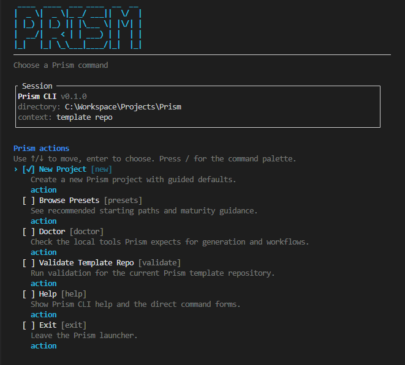
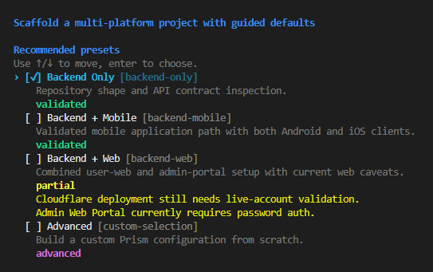

# Getting Started

For the workflow and shared human/agent board without generating applications,
use the [shared board guide](shared-board.md). This page covers the optional
application-generation path.

This page is the safest first-run path for trying Prism.

If you only want the shortest route:

1. install Prism locally from this repo
2. run `prism doctor`
3. run `prism`
4. generate one focused sample
5. validate the generated repo
6. inspect the generated repo and run `setup-project`
7. validate the slices you care about before treating them as settled

## 1. Pick A Small First Evaluation Path

Use the smallest path that answers your question.

Recommended first evaluation paths:

- **Backend only** for repository shape and contract inspection
- **Backend + Mobile** for the partial multi-client scaffold; runtime verification remains separate
- **Backend + Web** to inspect the combined user-web and admin-portal setup

For the maturity notes behind those recommendations, read
[current-status.md](current-status.md).

## 2. Install Prism And Its Prerequisites

Start with the minimum needed to generate a project, then add the rest based on the
workflow you want to exercise.

Required to generate a project:

- Python 3.10+
- `pip install -e .` from this checkout

The editable install is distributed as `prism-kit` and exposes the `prism` command;
the import package remains `prism_cli`. It installs the CLI's generation dependencies
(`copier`, `jinja2-time`, and `PyYAML`) and shared-board runtime dependencies
(`mcp==2.2.0` and `uvicorn`) from `pyproject.toml`. A published package or
remote `pipx` install path is still pending and should not be treated as available.

To try the wheel install path locally, build and install the wheel from this checkout:

```bash
python -m pip install build
python -m build
python -m pip install dist/prism_kit-0.2.0-py3-none-any.whl
```

The installed CLI uses the canonical GitHub template by default. A local checkout
uses its local template automatically. Pass `--template <path-or-url>` to choose a
different template explicitly.

Useful first commands after install:

```bash
prism --version
prism doctor
prism doctor --preset backend-mobile
prism presets
```

`prism doctor` now separates Prism core readiness from workflow and platform checks, so it
is the fastest way to see what is blocked versus what can wait.

Required to use generated task commands:

- [go-task](https://taskfile.dev/)

Required for shared tooling in generated projects:

- Node.js LTS
- `npm install -g @openapitools/openapi-generator-cli`
- `npm install -g hygen`

Required for common backend and container workflows:

- JDK 21
- Docker Desktop

Required for iOS work on macOS:

- `brew install xcodegen`
- Xcode
- `gem install fastlane`

`go-task` and the platform generator CLIs remain external dependencies for generated
projects. They are not bundled with generated projects; use `prism doctor` to see
which optional tools are available.

## 3. Generate Your First Project With Prism

From a local checkout of this repository:

```bash
prism
```

Running bare `prism` opens the Prism home screen. From there you can:

- choose `New Project`
- choose `Doctor`
- choose `Validate`
- choose `Presets`
- press `/` to open the command palette and filter commands directly



If you run `prism new` with no extra flags, Prism starts the guided interactive flow:

- shows the recommended presets
- lets you choose a preset or advanced mode
- asks for missing project details
- uses interactive selectors for platform and auth choices
- defaults the destination folder to `workspaces/<project-slug>`
- shows a final review screen before generation



You can also generate non-interactively with a recommended preset:

```bash
prism new --preset backend-mobile --project-name "My Mobile App" --dest ../my-mobile-app
prism validate ../my-mobile-app
```

The Prism CLI is now the main entry point for generation in this repository. Raw Copier
commands remain the lower-level fallback underneath it.

Optional deeper context before choosing a non-standard path:

- read [questionnaire.md](questionnaire.md) if you want the full question surface and option-specific caveats
- read [current-status.md](current-status.md) if you want the latest maturity guidance before evaluating a partial slice

## 4. Validate What You Generated

Start with the Prism CLI structural check:

```bash
prism validate /path/to/generated-project
```

Then, if the supporting tools are installed:

- run `task validate-api`
- run `task generate-clients`
- inspect the generated root `Taskfile.yml`
- inspect platform-specific docs and environment files

Platform-specific caution:

- for `web-user-app` and `web-admin-portal`, inspect Next.js routes, auth handlers, and
  OpenNext/Wrangler config before treating the setup as settled
- for `mobile-ios`, validate locally on macOS before treating the slice as build-proven

Do not assume every command, workflow, or platform combination has been fully hardened just
because the repository generated successfully.

For the generated workspace contract and current wiki queues, use the read-only status
surface:

```bash
prism status /path/to/generated-project --full
prism status /path/to/generated-project --full --json
prism doctor --workspace /path/to/generated-project
```

`status --full` includes the effective `SETTINGS.md` staleness setting, advisory review
counts, documented generation answers, and template provenance. It omits private Copier
metadata and unknown answer keys. `doctor --workspace` returns a validation failure when
the manifest, answers, or detected platform directories contain contract errors.

If you are maintaining the Prism template repo itself, you can also run:

```bash
prism validate --kind template --template-mode contract .
```

## 5. Inspect The Generated Repository

Before treating the generated repo as production-ready, start with structural checks:

- confirm the selected platform directories exist
- confirm `README.md`, `CONTEXT.md`, and `knowledge/wiki/SCHEMA.md` exist
- inspect the generated root `Taskfile.yml`
- inspect `.github/workflows/` for the slices you selected
- inspect the generated platform docs

Then move into the generated project workflow:

1. open the generated repository
2. initialize the wiki with:
   - Claude Code: `/setup-project`
   - Codex: `$setup-project`
   - Cursor: ask the agent to run `setup-project`
3. inspect `knowledge/wiki/SCHEMA.md`
4. run `feature-status` if you want an orientation report
5. use the read/query layer before mutating lifecycle state

The feature lifecycle has separate confirmation-gated actions. Use
`$po-specify F-XXX` in Codex or `/po-specify F-XXX` in Claude Code to read one
`raw` + `po` feature and prepare its complete structured draft. It carries
supported facts forward and keeps unknowns as owned questions. A well-structured
raw body may be verified and preserved; an incomplete one is authored before
the status changes. After factual completeness, use `po-handoff` for
`specified` + `po` -> `ready-for-design` + `designer`, then use `design-start`,
`design-handoff`, `dev-start`, and `dev-done` for the confirmed downstream
routes. Reopen shipped work with `feature-reopen F-XXX [specified|in-design|in-dev]`
after impact review. Each action reads one exact source pair and leaves the
feature, index, and log unchanged when declined or cancelled.

The optional read-only preflight is:

```bash
prism wiki transition-preflight F-XXX /path/to/generated-project --action po-handoff --json
```

Use it only when its response explicitly identifies common envelope schema 1,
the transition-preflight command facts, capability version 2 with the requested
action's surface, transition version 1, and a consistent snapshot. A `0.2.0`
version string alone does not prove that surface; missing or unsupported
capability falls back to direct wiki reads. The preflight and dashboard are
copy-only, and the agent must reread the source before any confirmed write. The
selected generated action file must contain its matching
`<!-- prism:<command>-contract:v1 -->` marker; the other surface is optional.
Refresh a selected file with a missing marker before using that action.

For a shipped feature, `dev-done` requires a current Delivery evidence row for
each declared platform with verifiable implementation, tests, and release
references. A confirmed reopen archives the previous evidence, removes it from
active readiness, and sets route-specific `revalidation` domains as described in
the generated `knowledge/wiki/SCHEMA.md`.

If you want the conceptual reason Prism works this way, read
[prism-model.md](prism-model.md) before going deeper into the generated workflow.

For the generated-project structure and safe-first commands, continue with
[generated-projects.md](generated-projects.md).

## 6. Update A Generated Project

Inside a generated repository:

```bash
prism update /path/to/generated-project
```

This is the Prism-managed update path. It expects the generated project to include
`.copier-answers.yml`, which Prism writes during `prism new`.

Use updates only after reviewing template changes and only in a generated project that is
already under version control with a clean git working tree.

During local incubation, Prism may fall back to a Copier `recopy` strategy because the
template repo is not yet version-tagged for a full `copier update` flow. If you need to
force that path:

```bash
prism update /path/to/generated-project --strategy recopy
```

Recopy overwrites customized template files. Non-interactive recopy requires `--yes`.
Custom template sources require a separate trust confirmation or `--trust-template`;
`--yes` does not grant code-execution trust. Raw Copier generation now saves
`.copier-answers.yml`, including version provenance when the source is versioned.

## 7. Raw Copier Fallbacks

If you need to bypass the Prism CLI and generate directly:

Generate from GitHub:

```bash
copier copy --trust https://github.com/mo0rti/prism.git ../my-new-project
```

Generate from a local checkout:

```bash
copier copy --trust . ../my-new-project
```

The `--trust` flag is required because this template uses the `jinja2_time` Jinja
extension.

The Prism package already installs Copier and `jinja2-time`. Install those packages
separately only when using the raw Copier path without installing Prism:

```bash
python -m pip install copier jinja2-time
```

Use the raw Copier path when:

- you are contributing to the template and want the fastest low-level feedback loop
- you need to compare Prism CLI behavior with the underlying rendering path
- you are debugging Copier-specific generation behavior

## 8. What To Read Next

If you just generated a project:

1. [generated-projects.md](generated-projects.md)
2. [prism-model.md](prism-model.md)
3. [wiki-workflow.md](wiki-workflow.md)

If you are evaluating maturity before deeper adoption:

1. [current-status.md](current-status.md)
2. [wiki-validation.md](wiki-validation.md)

If you are maintaining the template:

1. [maintainer-workflow.md](maintainer-workflow.md)
2. [questionnaire.md](questionnaire.md)
