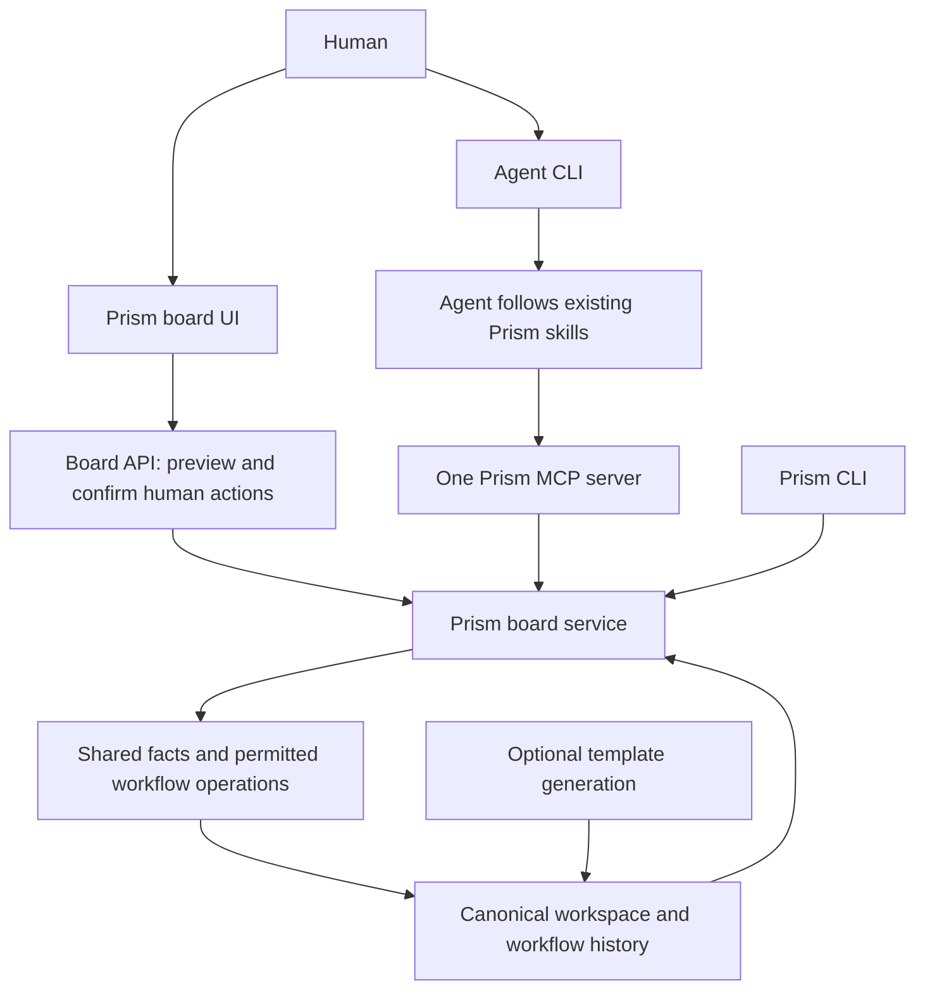

# Prism core workflow and board plan

Date: 2026-09-22

Status, 2026-09-25: The approved core scope is implemented. The initial Fable review judged its snapshot implementation-ready; its four low findings are corrected and human HTTP/agent MCP parity checks pass. The recorded r7 verification passed 385 tests with one skip, installed-wheel checks and both broad generation variants. The focused Fable follow-up completed on September 25 with no new defects, confirmed the parity gap closed, and judged implementation readiness met. Actual browser acceptance, agreed performance budgets and release gates remain open. [Connected-core acceptance](connected-core-acceptance.md) records the evidence and limits. Remote access and the remaining direct-human lifecycle actions remain deferred.

## Product direction

Prism should help humans and agents carry product work from intent through review, implementation, and delivery using shared, inspectable evidence. The workflow and board are the center of the product. Template generation is one way to start a workspace.

The first useful outcome is that a person can open a project, understand what needs attention, inspect the evidence, and perform a permitted workflow action in the board or direct an agent through its CLI. Everyone should see the same underlying state and the reasons work is ready, blocked, or uncertain.

The workflow board and the advisory board have different purposes. The workflow board presents delivery state and handoffs. The advisory board contributes domain review and decisions to the same product knowledge.

Agents should connect to a Prism board through one shared, provider-neutral interface. Prism should not require a separately implemented connector or workflow for each coding agent or model provider. MCP is the recommended standard interface to evaluate and deliver through the connection milestone below.

## Confirmed scope and retained work

- Prioritize Prism's workflow, board, dashboard, CLI, and workspace reliability.
- Defer remaining backend, web, and mobile sample-app findings. Preserve changes already made to those samples and their validation evidence.
- Use a product-neutral workflow fixture for core acceptance. TreasuryFlow remains an example, and its business behavior does not define Prism's core requirements.
- Plan the broader product direction alongside the core review fixes.
- Make a shared agent connection part of the core product plan. Client-specific setup instructions may differ; Prism's tools, rules, and collaboration behavior must remain common across clients.
- Humans direct their agents in the agent's CLI. Agents use the existing Prism skills to perform intake, refine work, and move items through the workflow. Preserve each skill's existing confirmation behavior; do not add a mandatory second approval in the board UI.
- Include direct human lifecycle moves in the board. Drag-and-drop and an equivalent click/keyboard action select a named workflow action, show its requirements and proposed changes, and require the human's confirmation before applying it through the shared service. A human can complete a supported move without an agent. The confirmed first-release matrix below defines its scope.
- Deliver the first shared connection for a local board and agents on the same computer. Plan remote access as a subsequent stage using the same contract.
- Allow local working-file generation with truthful unversioned provenance. Do not claim that an uncommitted snapshot has a reproducible Git commit baseline.
- Use the recommended field-level manifest merge approach described below. Do not silently discard competing changes.
- Preserve existing workspace data, Git changes, and working agent guidance. No publication, repository migration, or application redesign is part of this planning step.

The previous sample decisions about sessions, OAuth, transactions, email identity, and logout remain recorded in the conversation. Deferring their remaining implementation does not reverse those decisions.

### Confirmed implementation decisions, 2026-09-22

- The first direct-human release supports `design-start`, `dev-start`, and `po-handoff`. Specification, design handoff, completion, and reopening continue through agent skills; the UI must identify them as request-only rather than silently applying a status change.
- One explicit local service owns each workspace and exposes both the board API and the shared MCP interface. Participants receive separate revocable access tokens. Remote access remains out of scope.
- Standard skills have a canonical source and are bound to the workspace's workflow version. Local custom skill edits remain available through the existing direct-file path, not silently substituted into the connected contract.
- Freshness uses the approved hybrid policy: reject changes to relevant action inputs, while preserving unrelated work and the human's unsent inputs. Recheck current deterministic conditions at apply time; a calendar change alone must not be reported as a source edit.
- Durable operation receipts and recoverable writes support human-only recovery through the board. Actor attribution belongs to the operation journal plus a versioned history format; legacy/direct-file changes remain unattributed.
- Old workspace contracts stay read-only until an explicit workflow upgrade. Blocked mapped drops open an explanatory preview with confirmation disabled, matching the action controls.
- Adoption supports both existing repositories and empty workspaces. Keep the five current platform identifiers initially; arbitrary component labels remain deferred. Preserve application files and custom guidance through a reviewed setup diff. Agent-led `setup-project` remains the workflow initialization step after asset installation.
- Implement the shared service before its human UI and MCP adapters, using a thin workflow foundation first. Existing-repository adoption and the remaining board improvements follow the connected foundation. Template generation remains an optional user journey.
- Luna at maximum effort implements bounded tasks; the root agent reviews and integrates the work. Claude Fable 5 reviews the completed implementation and its validation evidence.

## Foundation and gaps at planning review

These observations describe the checkout reviewed before implementation. Current
behavior and validation are tracked in [current-status.md](current-status.md).

| Area | Current behavior | Implication for this plan |
| --- | --- | --- |
| Product knowledge | Markdown wiki, feature pages, requirements, decisions, questions, and evidence are read from the repository. | Reuse this source of truth. Avoid introducing a second authoritative board database in the initial delivery. |
| Lifecycle | Nine actions cover specification, handoffs, design/development starts, completion, and reopening. | Improve the existing lifecycle instead of rebuilding it. |
| Workflow board | Dragging to a supported destination opens the same preview as the action controls. Previews copy requests; the browser does not write lifecycle state. Cards move after refreshed wiki state changes. | Preserve this read-only compatibility path. Direct human moves require a new, explicitly advertised write capability; existing drag behavior is not evidence that it exists. |
| Agent work | Generated Codex skills and Claude commands reread evidence and request confirmation before writes. | Keep shared workflow semantics while preserving each tool's supported packaging. |
| Agent connection | The runtime has no MCP server or shared agent participation API. `/data.json` and `/events` serve the dashboard; they are not MCP endpoints. | Add an explicit connection milestone. Existing prompts and copyable requests do not satisfy connected collaboration. |
| Workspace identity | Detection, scope checks, and capabilities are closely associated with generated repositories and Copier metadata. | Existing-repository adoption needs an explicit core workspace contract. |
| Ownership and scope | Owners are workflow roles; platform identifiers are five built-in application slices. | Named human/agent assignment and arbitrary project components are product decisions, not already-supported capabilities. |
| Update reliability | A real-manifest installed-CLI reproduction exits 3 after an update leaves conflict markers in the manifest. | Repair this before relying on updates to maintain working boards. |
| Live recovery | Source inspection shows same-server reconnect events can leave Copy disabled and recreate a green LIVE indicator. | Reproduce and fix stale-state presentation and recovery. |

Source anchors: [workflow model](prism-model.md), [lifecycle contract](../template/knowledge/wiki/SCHEMA.md), [current lifecycle acceptance](lifecycle-transitions-acceptance.md), [workspace inspection](../prism_cli/workspace.py), [transition evaluator](../prism_cli/wiki_transitions.py), and [local server](../prism_cli/graph_server.py).

## Settled contracts and later decisions

The owner confirmed the first-release contracts below. These are implementation
constraints, not requests for renewed approval. A new visual design, named
assignment, arbitrary component labels, and remote hosting remain later work.

| Decision | Confirmed first release | Boundary |
| --- | --- | --- |
| Adoption | Support existing repositories and empty workspaces through a previewed installation. | Preserve existing knowledge and custom guidance; conflicts require resolution. |
| Board actions | Humans confirm their own named actions; agents follow skill confirmations in their CLI. Both use one service. | No second approval queue for agents and no automatic agent launcher. |
| Human/agent ownership | Retain PO/designer/dev roles; record the registered participant that performs each connected operation. | Tokens establish a participant, not an independently verified person's identity. Named assignment remains later work. |
| Project scope | Keep the five current platform IDs for generated and workflow-only workspaces. | Arbitrary component labels remain deferred. |
| Agent protocol | One standard MCP endpoint and versioned tool contract, backed by the shared service and packaged skills. | Use the official SDK and verify real client compatibility; no provider-specific workflow connectors. |
| Deployment model | One local process per workspace with separate revocable participant tokens. | Remote hosting and authorization remain deferred. |
| Human action coverage | Direct `po-handoff`, `design-start`, and `dev-start`; the other six actions remain agent-led. | Keep existing prerequisites and review obligations. A gesture cannot author missing evidence. |
| Browser write authority | Participant-bound browser sessions, origin/CSRF protections, explicit confirmation, and server-side validation on every operation. | Legacy/static views remain copy-only; old workspaces need an explicit upgrade. |

The detailed action, freshness, recovery, and acceptance requirements below remain
part of the implementation contract.

The owner also confirmed the implementation clarifications: the first connected
intake release is text-only and clearly reports unsupported attachments; a human
with board write access may review and recover an interrupted agent operation
after that agent's grant is revoked; and ordinary workflow blockers are readiness
information for `prism validate`. Integrity errors still fail validation and a
blocked transition preflight still exits 3. Human recovery requires a fresh review
of the remaining changes and records the original and recovering actors separately.

## Intended architecture

Use the existing modules as the starting point. Establish boundaries through a small number of concrete changes before considering a package or directory reorganization.

This is the approved connected architecture being implemented. Humans confirm
their own board actions in the UI; agents keep each skill's confirmation process
in their CLI. The browser uses the board API and does not need an MCP client or a
running coding agent. The service reuses the existing core in this repository.

The core owns workspace inspection, evidence parsing, queries, lifecycle rules, readiness, and board projections. The board UI, CLI, and MCP server use those same facts and operation contracts. The existing Prism skills define how agents do the work. Publish that guidance through a common interface, while preserving existing Codex and Claude packaging as compatible entry paths. Provider-specific connector code must not determine the workflow. Generation supplies application scaffolds and initial workflow assets through the same core contract.

## Human moves in the board

### From a gesture to a confirmed workflow action

The new human path is an explicit addition to the current copy-only board. A drop selects an action; it does not itself prove that its prerequisites, review, or underlying work are complete.

1. The human drags a feature to an eligible stage or selects the equivalent action by click or keyboard. Resolve the named action from its current source and proposed destination; when more than one action is possible, require an explicit selection. Same-column drops do nothing. Unsupported destinations explain why the feature cannot move there.
2. The service reads the current workspace and returns a preview bound to the action, relevant source revision, and applicable workflow version. Show the source/destination, evidence, required human review, proposed file changes, and blockers or unknown facts. Keep the card in its current source-derived column.
3. The human reviews the evidence and supplies the approved action-specific inputs. Structural checks do not establish semantic quality: the UI must expose the review obligations a human must perform, just as skills expose them to agents. Missing artifacts must be authored or corrected before proceeding; dragging does not generate a specification, design, implementation, review, or release evidence. Any input change requires an updated preview and checks.
4. The human confirms that exact preview in the board. The authenticated or locally authorized participant, board, action, inputs, expected revision, and operation identity are bound to the request. There is no confirmation in an agent CLI for this path, and no agent is launched.
5. The service rechecks authorization, source freshness, allowed write scope, and lifecycle invariants before applying the approved changes. Save the action contract's complete approved write set, including any requirement, API, advisory, evidence, index, log, or reopen-history changes. Record the acting participant and the actual outcome without claiming a stronger real-person identity than the local access mechanism can establish.
6. Show success only after a completed operation result and refreshed canonical state establish the change. Other board viewers and agents retrieve the same updated facts. Rejection leaves source files unchanged; an uncertain or partial write outcome is shown as needing reconciliation, not as a successful move or an automatic rollback.

The server performs deterministic validation and bounded writes. The human performs the action's semantic review; for the agent path, the agent follows the existing skill. A shared versioned action contract must describe the invariants, evidence, and permitted writes used by both paths. A UI checkbox, an agent statement, or a passing preflight is not independent proof of the quality of that review or of external shipment.

### Example: completing development

The future direct-human Done flow would select the existing `dev-done` action and preview all applicable completion evidence, review obligations, proposed requirement/API completions, and post-ship notes. This action remains request-only in the approved first human release. Missing evidence or unresolved blocking facts prevent completion; a person or agent must verify the evidence before applying the full action contract. No gesture runs tests, deploys the application, or redefines Done.

Reopening likewise uses the existing named reopen route and its required reasons/revalidation. It is not an unrestricted backward status change. Its direct-human form remains deferred; the first three human actions use the confirmed fields and review obligations below.

### One set of rules across both paths

| Entry path | Review and confirmation | Application and observation |
| --- | --- | --- |
| Human board action | Human performs the action's review and confirms the exact preview in the board. | Board API calls the shared service; history identifies the authorized participant; all clients refresh from workspace state. |
| Agent using a Prism skill | Agent follows the existing skill, including its required confirmation in the agent CLI. | MCP calls the same service with that participant's authority; the board observes the result without another approval. |
| Existing copy-only board or static export | Prepare/copy an agent request using the existing capability. Copying is not write authorization. | No browser writes; the card remains a projection of the available source snapshot. |

Use the same lifecycle invariants and authorization model, while evaluating the actual actor's granted capabilities on every call; this does not give all humans and agents identical permissions. Human completion in the board must not depend on installed Codex/Claude instruction files. Actions lacking the agreed human review/input interface remain clearly unavailable for direct completion, with the existing prepare-request option where supported.

During concurrent human and agent work, a preview becomes stale if a relevant source changes. Reject the stale confirmation, retain the human's unsent inputs where safe, show the changed facts, and require a new confirmation. A same-column drop, cancellation before submission, or denied move must not dispatch agent work or change files.

After submission, a timeout or closed dialog cannot be treated as cancellation. Use a durable operation identity and receipt to retrieve the outcome; retrying the identical request must not duplicate a transition or history entry. Design and test crash recovery across the actual multi-file write sequence before enabling either browser or MCP writes. A small operation journal stores receipts and recovery metadata without becoming another authoritative board database. The board must offer a no-agent recovery path that reports observed changes and safely completes the recorded remaining writes; conflicting external edits must be preserved for explicit reconciliation. A successful receipt followed by a failed refresh is shown as applied with a stale view, not as a failed write.

Advertise browser write support separately from legacy preflight capability version 2 and `mode: copy-only`; retain their existing meaning. A missing grant, unavailable write service, static export, or workspace contract predating human moves must show the appropriate read-only state. Older workspaces require an explicit upgrade before writes are enabled. Never silently substitute copying a request after the user confirmed a move.

## Shared agent connection: MCP proposal

### One interface, different agent applications

Build one Prism MCP server exposing a versioned catalog of board operations. Each compatible agent application adds the Prism server through its normal MCP configuration. Changing the underlying model must not require a new Prism connector.

Compatibility belongs to the agent application that hosts the model and tools. A DeepSeek model, for example, can participate through an MCP-capable agent host; a model endpoint alone is not that host. Record compatibility by application/version, supported transport, and protocol capabilities. Do not promise support for every product based on its model name. This distinction follows MCP's [host/client/server architecture](https://modelcontextprotocol.io/specification/2026-07-28/architecture).

Recommend Streamable HTTP on a local endpoint for a board service shared by several clients. A generic stdio entry point can be added if the tested clients need it; it must route to the same board authority instead of creating independent writers for one workspace. MCP defines both [standard transports](https://modelcontextprotocol.io/specification/2026-07-28/basic/transports). Remote access is a subsequent stage, not part of the first connected release.

MCP supplies the communication interface. Prism supplies the collaboration rules and durable state. The agent host still runs the work loop; opening a connection or delivering a notification does not start model execution. Core collaboration should work with ordinary tool calls and explicit refresh, with optional protocol features improving the experience when available.

### Existing skills are the workflow interface

A person should be able to say "run PO intake on these notes" or "refine this work item" in their coding-agent CLI. The agent discovers and reads the appropriate existing Prism skill, obtains the current project context, follows its instructions, and applies the permitted changes. MCP makes the same guidance and workspace operations available regardless of which agent application is used.

Expose skill discovery and complete skill content through ordinary MCP tools/resources as the compatibility baseline. Include referenced instructions and the workspace-specific context, so a client does not receive a thin wrapper pointing to a missing `.claude` file. Optional MCP skill or prompt features can improve presentation after client validation; they must not be required for the first journey.

Start from [PO intake](../template/.agents/skills/po-intake/SKILL.md.jinja), [PO clarification](../template/.agents/skills/po-clarify/SKILL.md.jinja), [PO specification](../template/.agents/skills/po-specify/SKILL.md.jinja), and [PO handoff](../template/.agents/skills/po-handoff/SKILL.md.jinja), including their referenced detailed guidance. Extend the same method to the other existing core skills. Reuse their meaning and rules; any transport-related wording changes must preserve the workflow.

Natural-language instructions select a skill; they do not create new lifecycle semantics. For example, "refine" may mean resolving an open question with `po-clarify` or preparing a raw feature with `po-specify`. The agent follows the existing guidance and clarifies the intended operation when necessary.

### Shared capabilities

These are candidate operation groups for the contract design, not implemented endpoints or settled tool names. Use MCP [tools](https://modelcontextprotocol.io/specification/2026-07-28/server/tools) for discoverable operations and [resources](https://modelcontextprotocol.io/specification/2026-07-28/server/resources) for addressable context. Essential context must also be reachable through tools for clients with limited resource support.

| Capability | Intended collaboration |
| --- | --- |
| Discover board and permissions | Identify the selected board, workflow version, participant, allowed operations, and declared project scope. |
| Discover and read Prism skills | Retrieve the existing skill instructions, inputs, referenced guidance, permitted write scope, and applicable workflow version. |
| Read work and context | Find features, ownership, blockers, questions, decisions, source references, and current preflight results. |
| Read intake and refine work | Give intake and clarification skills access to their current source material and the wiki artifacts they are allowed to create or update. |
| Check a skill's intended changes | Reuse applicable feature preflight and source checks, and add deterministic checks required by the write contract. For intake/clarification, provide current facts and duplicate/source signals for the agent's semantic conflict review; no existing mechanical intake preflight is implied. Return the exact proposed changes for the skill's confirmation steps. |
| Apply skill-scoped changes | Let the agent perform the selected skill's authorized writes, including feature content, permitted lifecycle fields, index/log updates, and intake moves where that skill allows them. The service checks permissions, source freshness, and structural invariants. |
| Observe the result | Return the actual changes and any partial failure. The board reflects updated source state; other agents can retrieve it. |
| Catch up after changes | Fetch changes since a cursor and reread current state; support notifications where available without requiring them for correctness. |

Cover the existing core skill set, including intake and clarification as well as the nine lifecycle transition actions. Named participant assignments, work claims, and a separate board chat are not prerequisites for this skill-driven connection. A connected client must not need `.agents/skills` or `.claude/commands` installed merely to discover or use the shared interface. Separate core action availability from the legacy check for a particular tool's generated instruction files.

### A human and agent journey

The first connected-agent journey starts in the human's agent CLI. It complements the direct human board journey above:

1. A PO gives an agent an instruction such as "run PO intake on these notes" in the CLI.
2. The agent connects to the local Prism board, reads `po-intake` and its references, and inspects current intake and wiki facts.
3. The agent interprets the input, checks conflicts, and follows the skill's existing confirmation process in that same conversation.
4. The agent applies the skill's permitted updates through the shared workspace operations. The board shows the resulting items and current lifecycle state.
5. The human asks the same or another connected agent to refine or hand off an item. That agent reads the applicable existing skill and current sources, then follows the same rules.
6. Humans observe the board and agents retrieve the same changed facts. After the direct board-action milestone, a human can perform a subsequent permitted action in the board; an agent then rereads that result before continuing. Reconnection preserves the ability to recover the current result.

No additional board approval queue is introduced for agent actions. Skills that require confirmation still obtain it in the agent CLI. A human confirming their own board move is a separate entry path, not a second approval of an agent's work. The connection does not weaken existing evidence, advisory, or completion requirements. Code execution remains in the agent's environment; the Prism server exposes defined workspace operations rather than an arbitrary shell.

### Identity, concurrent work, and persistence

Define these behaviors in the shared contract before enabling writes:

- Bind access and recorded authorship to a Prism participant and board grant. A client-provided model name, display name, or MCP connection identifier is not sufficient identity or authority.
- Apply that authority model to browser writes as well as MCP calls. Specify the local browser access/confirmation mechanism, board binding, request-origin and cross-site request protections, credential handling, and grant revocation before exposing write endpoints. An open local tab alone is not proof of identity or permission.
- Keep role, assignee, participant identity, and reported activity distinct. Show last contact or acknowledged work without claiming that an idle connected agent is actively executing.
- Enforce the same authorization rules and observable lifecycle checks through supported entry points, evaluated against each actor's actual grant. Bind a browser confirmation to its exact preview and preserve each skill's host-side confirmation process. A server can validate an operation and its source revision, but a client-supplied statement is not independent proof of a human's confirmation or the quality of semantic review.
- Use expected revisions to reject stale updates. Make retries of the same operation return the recorded outcome without repeated intake moves, duplicate log entries, or repeated transitions. Work-claim semantics remain a separate product decision.
- Reuse the wiki, open-question structures, index, and workflow history. Define the minimum additional operation metadata needed for retry and interruption recovery, rather than creating a parallel collaboration database or replacing the skills' formats.
- Treat direct repository edits as external changes: revalidate affected previews and do not invent authorship. Preserve the existing direct-file skill path as a compatibility route, while testing the shared MCP path independently. MCP access limits govern the server's operations; they do not sandbox an agent's independent filesystem access.
- Use board-scoped access and revocation. If remote access is selected, include standard MCP HTTP authorization and client compatibility in that milestone; the protocol defines an [HTTP authorization framework](https://modelcontextprotocol.io/specification/2026-07-28/basic/authorization), while Prism must define the actual board permissions.

Pin and test the selected MCP specification and SDK together. At this planning check, the official [latest specification](https://modelcontextprotocol.io/specification/latest) resolves to `2026-07-28`; older clients may need the SDK's standard compatibility behavior. Do not build the first journey around an optional extension that the selected clients cannot use.

## Delivery sequence

### Milestone 0: Agree the product boundary

The owner confirmed adoption, local access, scope, staged human actions and the shared-service design. Preserve both the local, CLI-directed, skill-driven agent connection and direct human board actions. The service advertises each skill's readable guidance and supported write scope; unsupported connected writes are explicit.

Keep the current lifecycle stages and completion evidence rules as the baseline. Changes to what Done means, advisory obligations, permissions, or workflow stages require explicit decisions.

For human moves, implement the approved coverage matrix: direct-board completion for `po-handoff`, `design-start`, and `dev-start`; request-only for `po-specify`, `design-handoff`, `dev-done`, and the three reopen routes. Preserve the exact source status/owner pair, target, complete per-action write set, semantic review obligations, evidence, authorization, confirmation, and recovery. Document and test deterministic write checks added beyond today's preflight; a ready read-only preflight is insufficient by itself. Shared contract/version ownership keeps browser forms, served skills, and legacy packages aligned.

The user has confirmed the local process/access, canonical/versioned guidance, customization, freshness, recovery, history, legacy eligibility, adoption, scope compatibility, and staged human coverage recommendations from the [first Fable review](reviews/2026-09-22-fable5-prism-core-plan-review.md) and [round two](reviews/2026-09-22-fable5-prism-core-plan-review-round-2.md). Apply content-trust and path-confinement protections to both browser and MCP writes. Enumerate connected skill scopes explicitly; trusted packaged instructions must remain separate from untrusted workspace content.

**Exit:** a concrete first-release scope, agreed interaction behavior, and a short list of deferred capabilities. No visual or data-model assumptions remain in the next implementation slice.

### Milestone 1: Make the current core dependable

These repairs form the first part of the approved implementation. They also retain independent regression coverage within the integrated delivery.

| Priority | Work | Acceptance evidence |
| --- | --- | --- |
| 1 | Repair dashboard reconnect and stale-state behavior, N-11. Derive the indicator from state, fetch again after a same-version reconnect, and avoid a false failure announcement on the first connection. | Disconnect disables copying and shows stale state after rerenders; same-server reconnect restores current facts; restart with a lower version works; an old open preview cannot silently become approved. |
| 2 | Repair workspace manifest update handling, N-01. Preserve customizations and prevent dynamic provenance from creating merge conflicts. | Installed CLI creates a project using the real manifest, updates across actual template revisions, preserves independent customizations, and stops before applying a genuine manifest conflict. The board remains readable after a successful update. |
| 3 | Validate CLI input before prompting or rendering, N-12/N-13. Add the slug override and pass the same resolved slug to Copier. | Closed stdin and malformed answer types/values return documented errors without tracebacks or destination writes; display names and valid custom slugs work consistently. |
| 4 | Correct local and updated template provenance, N-14. Preserve Copier's recorded revision for versioned updates. | Local working snapshots are identified as unversioned; updating from a tagged source retains the actual selected baseline, including when its checkout HEAD differs. |
| 5 | Finish core documentation and output corrections, N-15/N-21. Verify the existing preflight output fix and correct maturity, validation, and link claims. | Human output and JSON agree; documentation points to distributed evidence and separates structural checks from runtime verification. |
| 6 | Close the bounded core review follow-ups. Review framing protection, repeated per-client polling, normal blockers versus integrity errors, and the meaning of `supported`. Finish verification of the existing shared parser/link cleanup. | Focused boundary tests, measurements with one and several clients, and matching query/board results. Any behavior or schema change is agreed before editing. |

Primary files: `prism_cli/cli.py`, `workspace.py`, `render.py`, `graph_server.py`, `assets/graph_template.html`, the shared `wiki_*` modules, `scripts/check-installed-cli.py`, `scripts/dashboard-boot-check.js`, core tests, and maintainer documentation. Template edits in this milestone are limited to core workflow assets and generation/update compatibility.

**Manifest merge policy:** compare the old template, the current workspace, and the new template field by field. Preserve user-only changes, apply template-only changes, and stop before modifying the project when both sides changed the same field differently. Regenerate Prism-owned provenance independently. Treat lists conservatively as whole values unless a specific merge rule is agreed.

Prism owns this semantic manifest update: exclude the manifest from Copier's text merge, render the old/new inputs without executing tasks, and reject unresolved baseline/conflict conditions before modifying the project. Milestone 1 also owns creation of the product-neutral core acceptance fixture used by later service, browser, and MCP checks.

Example: an unchanged minimum version can advance from `0.2.0` to the template's `0.3.0`; a workspace-only `team_notes` field stays intact. If the user changed the minimum to `0.4.0` while the template changed it to `0.3.0`, present that conflict for resolution. Do not choose either value silently. Cover new fields, deleted fields, unsupported schemas, malformed manifests, and interrupted updates in the compatibility design.

**Exit:** all in-scope core defects have current verification and a recorded disposition. Previous test passes are not substituted for tests of the final combined code.

### Milestone 2: Separate the workflow contract from application generation

Define the minimum information that makes a Prism workspace valid independently of its origin. Distinguish core schema/version and declared scope from optional generator source, answers, and application scaffold metadata.

Inspect the current checks before moving files. Reuse workspace inspection and shared query envelopes, and change only the checks that incorrectly require generation metadata or particular application directories for core workflow use. Keep real source-integrity failures explicit.

Make workflow schema and agent guidance available through a reusable installation path. The generation path should consume the same maintained assets. Preserve existing tool-specific syntax for compatibility, while defining core action capabilities independently of named agent files so the shared MCP interface can use them.

**Exit:** contract tests demonstrate equivalent workflow facts for a generated workspace and a minimal workspace with no application scaffold or Copier answer file. Existing generated projects remain readable; incompatible schemas have a clear migration or upgrade path. New public fields and version changes are documented.

### Milestone 3: Add safe adoption for existing projects

Implement only the entry paths approved in Milestone 0. A user should be able to inspect a proposed Prism setup before files change. Existing source code, project tooling, wiki content, and agent instructions must be preserved or explicitly merged.

The entry points are `prism workflow install` and `prism workflow upgrade`, each with a preview before explicit `--apply`. The plan contains the exact file set and collisions. Adoption must not silently run application generation, replace a project's agent rules, or classify an unrelated code directory as workspace corruption.

Support a repeatable second run, a useful repair report for partial setup, and a clear record of the workflow version installed. Installation of workflow assets and later updates must follow the same preservation contract.

**Exit:** adopt a disposable existing repository with its own source, configuration, and agent guidance; verify the approved diff, idempotence, and a complete core workflow journey. Also test the approved empty-workspace entry path. Neither case needs a TreasuryFlow backend or mobile build to use the board.

### Milestone 4: Connect agents through the shared MCP interface

Specify skill discovery, complete guidance retrieval, common workspace operations, participant permissions, source revisions, result receipts, and change retrieval. Implement one local MCP server against the shared board service. Client-specific deliverables are configuration and verified compatibility notes, not separate implementations of Prism behavior.

Prove skill/read/discovery/preflight parity first as an internal checkpoint. Then complete the connected `po-intake` and refinement/handoff journeys with the existing confirmation behavior in the agent CLI. A read-only checkpoint or a copyable prompt is not completion of connected skill execution. In this milestone the board observes current work; direct human completion follows in Milestone 5 using this service. A board approval queue for agent actions is not required. Preserve the legacy preflight version 2 copy-only contract while versioning the new write interface independently.

**Exit:** two distinct MCP-capable agent applications on the same computer connect to the same board and retrieve the same existing skills without custom Prism connector code. A human directs intake and item refinement through the agent CLI, required confirmations remain there, and the board reflects the actual writes. Verify a stale preview, competing updates, retry, revoked access, disconnect, and partial-write recovery. Test the minimum common capability set; record unsupported or unavailable clients precisely. Remote access is a later acceptance stage.

### Milestone 5: Add direct human actions and improve board collaboration

Design and agree the board experience around the selected journey before changing layout or interaction behavior. The core questions are: what needs attention, why is it blocked, who should act next, what evidence is missing, and what happens after a request is prepared?

Build on the existing card, inspector, lifecycle preview, role queries, and the minimal connected journey delivered in Milestone 4. Implement the approved human-action matrix through the shared service: drop or select an action, review requirements and exact changes, supply supported inputs, confirm in the UI, apply with current authorization/revision checks, and show the durable outcome. Human actions must work with no coding agent running. The browser API and MCP adapter must not implement separate lifecycle policies.

Prioritize clear questions, handoff context, evidence links, and recovery when sources change. Keep feature lifecycle state separate from pending operation state. A completed write result updates the canonical board; a gesture, request, or optimistic animation alone does not. Retain copy-only compatibility and clear unavailable-action explanations for unsupported human actions, older workspaces, and static exports.

If named human/agent assignment is approved, define its schema and history before adding controls. Labels must distinguish a reported assignee or manual acknowledgement from verified actor identity or observed execution. A board gesture or clipboard success cannot establish that work began or finished.

Retain shared preflight behavior across the board and agents. Present semantic review obligations that still require a person or agent, even when structural checks pass.

**Exit:** a human completes a supported action entirely in the board without an agent; an agent reads that result and continues with the appropriate existing skill; a human then sees and can act on the agent's actual result. The agreed action matrix passes pointer, click/keyboard, and narrow-viewport checks. Verify blocked/unknown actions, missing evidence, same-column and unsupported drops, canceled previews, changed inputs, stale confirmation during a competing agent write, lost responses, repeated submissions, revocation, restart/partial-write recovery, and two viewers receiving consistent facts. Assert the exact feature/index/history changes and actor attribution limits. Agent actions require no second UI approval, legacy copy-only behavior remains truthful, and a gesture never fabricates completion evidence. Visual review uses the agreed design and an actual browser.

### Milestone 6: Keep generation as an optional capability

Expose application generation as an explicit entry path alongside workflow adoption. Generated projects receive the same core workflow assets and compatibility guarantees.

Retain approved template trust, release-tag selection, recopy confirmation, and provenance behavior. Assess package/dependency separation only after the core contract works; a plugin framework or separate repository is not a prerequisite.

Use documentation and maturity labels that identify which evidence concerns Prism itself and which concerns an application sample. Remaining sample repairs proceed under a separate scope when resumed.

**Exit:** users can enter the workflow without generating an application, while generation and updates continue to pass their compatibility tests. No sample build result is presented as proof that human/agent coordination works.

## Verification and acceptance

| Layer | Required verification |
| --- | --- |
| Shared facts | Unit and contract tests for queries, all nine lifecycle actions, blockers, malformed evidence, duplicate IDs, unsupported capabilities, and workspace identity. |
| Freshness | Same-server reconnect, server restart, failed fetches, changed/deleted sources during a preview, and source changes during snapshot assembly. |
| Preservation | Read-only commands and board inspection leave source files unchanged. Update and adoption tests inspect the exact resulting diff and conflict behavior. |
| Installation | Fresh installed-wheel tests outside the checkout, with Copier absent from PATH; real-manifest update fixtures and matching/missing release tags. |
| Agent surfaces | Rendered Codex and Claude guidance agrees with the action contracts and preserves the reread, proposal, confirmation, and evidence requirements. Prompt presence alone does not prove agent compliance. |
| Shared connection | Two different agent applications use one MCP server and common operation schemas. Missing vendor-specific instruction folders do not block the connected path. Core use works with the minimum supported protocol capabilities. |
| Skill delivery | Complete existing skill instructions and references are available through MCP. Input, conflict, confirmation, write-scope, and recovery behavior matches the current skill contract. Intake/clarification coverage supplements the nine transition checks. |
| Human board actions | Test the approved per-action coverage matrix with no agent running. Drag and click/keyboard produce equivalent previews and confirmed writes. Missing evidence, blocked/unknown facts, same-column drops, cancel, and denied/unsupported actions cause no writes; static/legacy surfaces remain copy-only. Verify exact write scope and the human's required review inputs, not just a moved card. |
| Collaboration | A human directs multiple agents through their CLIs and also performs their own confirmed board actions. Each path reads the other's actual results. Verify competing edits, changed inputs, stale previews, repeated submissions, lost responses, revocation, crash/partial-write recovery, and participant attribution limits. The human's own confirmation does not introduce an approval queue for agents. |
| Browser write boundary | Check board/participant binding, authorization on every operation, the agreed origin and cross-site request defenses, credential handling, and revocation. A rejected request produces no writes; external repository edits invalidate affected previews without inventing authorship. |
| Human/agent parity | The same action and inputs through the board and MCP produce equivalent canonical diffs apart from actor metadata. The same broken fixture is rejected through both paths. Include two-tab double-confirm, unrelated concurrent edits, midnight freshness, legacy-workspace write refusal, and successful-write/failed-refresh cases. |
| User experience | Actual browser checks for board state, focus, keyboard alternatives, themes, narrow screens, and interrupted live connections. Script harnesses support this evidence but do not replace it. |
| Scale | Measure representative small and large wikis with one and multiple viewers. Set response and refresh budgets from the baseline before accepting performance work. |
| Compatibility | Existing generated projects, unsupported schema versions, unversioned local sources, and any newly supported non-generated workspace. |

Use a small product-neutral scenario spanning intake, an unanswered question, a handoff, a blocked action, changed evidence, completion, and reopening. Cover both a human-only board move and alternating human/agent actions on the same item, including a competing edit while a drop preview is open. Maintain broader malformed and concurrency fixtures separately. Do not run lifecycle writes against this template repository.

Prior local checks remain useful historical evidence. The latest complete implementation must be tested before acceptance. Current browser attempts have been blocked with `ERR_BLOCKED_BY_CLIENT`. Earlier temporary sample-server launches were also rejected by automatic approval review with only `blocked by policy`; those sample runtime checks remain deferred with the sample scope. Neither limitation should be hidden behind passing builds.

Public release remains a separate milestone. The missing top-level license requires the owner's license, copyright holder, and year; this plan does not supply legal terms. Release-tag availability and publishing state must be checked against the actual canonical source before release.

## Review backlog disposition

The [2026-09-22 Claude Opus 5 review](reviews/2026-09-22-opus5-remediation-review.md) is preserved as a review of its frozen source snapshot. Its conclusions and counts are not a claim about later code. The [original review](reviews/2026-09-13-opus5-critical-review.md) remains the earlier baseline.

| Group | Disposition |
| --- | --- |
| N-01, N-11, N-12, N-13, N-14, N-21 | Implemented and checked in the recorded core suite, installed-wheel acceptance and current documentation audit; the initial Fable implementation review confirms their disposition. The focused follow-up closes F-1 through F-4 and the parity gap; wider connected acceptance remains gated on browser and release checks. |
| N-15 | Verified with actual CLI human/JSON preflight output: the same seven non-pass checks are reported, pass checks omitted from human output, and both exit 3. |
| O-1, O-2, O-9 | Framing protection, shared polling and `supported` wording are implemented and tested. Scale baselines are measured; no response/refresh budget is claimed. |
| O-3 | Owner confirmed normal blockers as readiness information for `prism validate`; the implementation and focused verification are in this pass. Integrity failures remain errors and blocked transition preflight exits 3. |
| O-10 | Shared parser/link cleanup has regression coverage. Domain-specific transition evaluation remains in its existing module; a larger module reorganization is deferred. |
| O-11 | In-memory `--open` and advanced Redis selection already have changes and targeted checks; retain regression coverage. |
| N-02 through N-10; N-16 through N-20 | Remaining sample-app findings deferred by the user's scope decision. This includes the approved but unfinished transaction, email, and logout work. |
| O-4 through O-8; O-12 | Sample security, networking, authorization, and deployment follow-ups deferred. |
| Existing original-review fixes | Preserve the work; recheck core changes together instead of restarting the entire review or expanding sample scope. |
| Earlier CLI/board acceptance records | Historical milestones. Keep their boundaries and distinguish them from current acceptance. |

**Current implementation boundary:** the approved core repairs, workflow adoption,
shared service/MCP and staged human-board implementation are complete and meet
implementation readiness against the reviewed r7 snapshot. The recorded r7 checks
passed; both Fable implementation reviews are complete, the four low findings are
resolved, and the focused review found no new defects and confirmed the parity gap
closed. Actual browser checks, agreed performance budgets and license/tag/
publication gates remain open. Remote access, wider human action coverage and
sample work remain deferred as described above.
