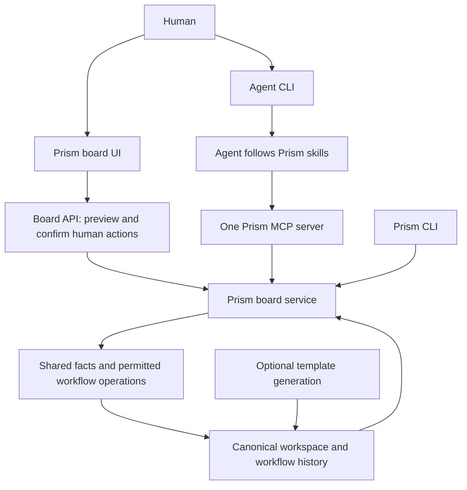

# Prism core workflow and board

This document states Prism's core scope and the contracts that the CLI, the board service, the browser board and the MCP adapter implement. [Current status](current-status.md) records what is verified and what is open. [Shared board](shared-board.md) is the usage guide.

The core is implemented: workflow adoption, MCP tool contract 2, the shared local service, the human board actions `po-handoff`, `design-start` and `dev-start`, and recovery of interrupted operations. A real-browser test suite exercises the board. Remote access, the six agent-led lifecycle actions as direct human actions, named assignment and arbitrary component labels are deferred. The release tag and publication are separate release gates; the license is MIT and the version is 0.3.0.

## Product direction

Prism helps humans and agents carry product work from intent through review, implementation and delivery using shared, inspectable evidence. The workflow and board are the center of the product. Template generation is one way to start a workspace.

A person can open a project, see what needs attention, inspect the evidence and perform a permitted workflow action in the board, or direct an agent through its CLI. Everyone sees the same underlying state and the reasons work is ready, blocked or uncertain.

The workflow board shows delivery state and handoffs. The advisory board contributes domain review and decisions to the same product knowledge.

Agents connect to a Prism board through one shared, provider-neutral interface. Prism has no separately implemented connector or workflow for each coding agent or model provider. The interface is a standard MCP endpoint.

## Scope

- Prism's workflow, board, dashboard, CLI and workspace reliability are the core. Core acceptance uses a product-neutral workflow fixture. The synthetic TreasuryFlow fixture is a demonstration, and its business behavior does not define Prism's requirements.
- Humans direct their agents in the agent's CLI. Agents use Prism's skills to perform intake, refine work and move items through the workflow, and each skill keeps its confirmation step. The board adds no second approval for agent actions.
- The board includes direct human lifecycle moves. Dragging a card, or an equivalent click or keyboard action, selects a named workflow action, shows its requirements and proposed changes, and requires the human's confirmation before the shared service applies it. A human can complete a supported move without an agent.
- The shared connection serves a local board and agents on the same computer. Remote access is not supported.
- Local working-file generation records truthful unversioned provenance. An uncommitted snapshot is never presented as a reproducible Git commit baseline.
- Workspace manifest updates merge field by field and never silently discard competing changes.
- Existing workspace data, Git changes and working agent guidance are preserved.

### Decisions

- Direct human actions are `po-handoff`, `design-start` and `dev-start`. Specification, design handoff, completion and reopening continue through agent skills, and the board identifies them as request-only.
- One explicit local service owns each workspace and exposes both the board API and the shared MCP interface. Participants hold separate revocable access tokens.
- Standard skills have a canonical source and are bound to the workspace's workflow version. Local custom skill edits stay on the direct-file path and are never silently substituted into the connected contract.
- Freshness rejects changes to relevant action inputs, preserves unrelated work and the human's unsent inputs, and rechecks deterministic conditions at apply time. A calendar change alone is not reported as a source edit.
- Durable operation receipts and recoverable writes support human-only recovery through the board. Actor attribution lives in the operation journal and a versioned history format. Legacy and direct-file changes are unattributed.
- A workspace pinned to an old workflow contract stays read-only until an explicit workflow upgrade. A blocked mapped drop opens an explanatory preview with confirmation disabled.
- Adoption supports existing repositories and empty workspaces. The five platform identifiers (`backend`, `web-user-app`, `web-admin-portal`, `mobile-android`, `mobile-ios`) are the workflow scope labels. Application files and custom guidance are preserved through a reviewed setup diff, and agent-led `setup-project` initializes the workflow after the assets are installed.
- Connected intake is text-only and clearly reports unsupported attachments.
- A writable human can review and recover an interrupted agent operation after that agent's grant is revoked. Recovery requires a fresh review of the remaining changes and records the original and recovering actors separately.
- Ordinary workflow blockers are readiness information for `prism validate`. Integrity errors fail validation, and a blocked transition preflight exits 3.

## How the core is built

| Area | Behaviour |
| --- | --- |
| Product knowledge | The Markdown wiki, with feature pages, requirements, decisions, questions and evidence, is the source of truth. The board has no second authoritative database. A small operation journal under `.prism/state/` holds grants, previews and receipts. |
| Lifecycle | Nine named actions cover specification, handoffs, design and development starts, completion and reopening. Each reads one exact source status and owner pair. |
| Workflow board | The board served by `prism board serve` previews and applies the three human actions. The `prism wiki graph` dashboard and static exports prepare copyable requests and never write. |
| Agent connection | One MCP endpoint at `/mcp` (Streamable HTTP) exposes 14 tools: `discover`, `list_skills`, `get_skill`, `get_skill_reference`, `list_workspace`, `read_workspace`, `query`, `preview_skill`, `preview_transition`, `get_preview`, `apply`, `operation`, `recover` and `changes`. The browser uses the same service through the board API. |
| Workspace identity | A workspace manifest records a board UUID, the workflow version, the mode and the canonical asset digest. The core contract does not require generated application directories or Copier answers. |
| Ownership and scope | Owners are the workflow roles `po`, `designer` and `dev`. Platform identifiers are the five built-in scope labels. A participant name labels a locally registered grant and is not a verified identity. |
| Updates | `prism update` merges the workspace manifest field by field and stops before changing the project when both sides changed the same field differently. |
| Live state | The board derives its live indicator from state, fetches again after a reconnect, disables copying while stale, and shows "Board session expired" with **Reconnect** after a service restart or an expired session. |

Source anchors: [workflow model](prism-model.md), [lifecycle contract](../template/knowledge/wiki/LIFECYCLE.md), [workspace inspection](../prism_cli/workspace.py), [transition evaluator](../prism_cli/wiki_transitions.py), [board service](../prism_cli/board_service.py), [MCP adapter](../prism_cli/board_mcp.py) and [board server](../prism_cli/board_server.py).

## Contracts

| Decision | Contract | Boundary |
| --- | --- | --- |
| Adoption | `prism workflow install` and `prism workflow upgrade` preview every file and apply only with `--apply`. | Existing knowledge and custom guidance are preserved; conflicts stop the command and name the file. |
| Board actions | Humans confirm their own named actions; agents follow skill confirmations in their CLI. Both use one service. | No second approval queue for agents and no automatic agent launcher. |
| Human and agent ownership | Roles stay PO, designer and dev. The service records the registered participant that performs each connected operation. | A token establishes a participant, not an independently verified person. Named assignment is deferred. |
| Project scope | The five platform IDs label scope for generated and workflow-only workspaces. | Arbitrary component labels are deferred. |
| Agent protocol | One standard MCP endpoint and a versioned tool contract (contract 2), backed by the shared service and packaged skills. | The official SDK is pinned (`mcp==2.2.0`). There are no provider-specific workflow connectors. |
| Deployment model | One local process per workspace with separate revocable participant tokens. | Remote hosting and authorization are not supported. |
| Human action coverage | Direct `po-handoff`, `design-start` and `dev-start`; the other six actions are agent-led. | Existing prerequisites and review obligations apply. A gesture cannot author missing evidence. |
| Browser write authority | Participant-bound browser sessions, Origin and CSRF protections, explicit confirmation and server-side validation on every operation. [SECURITY.md](../SECURITY.md) lists each check. | Legacy and static views stay copy-only. Old workspaces need an explicit upgrade. |

## Architecture

Humans confirm their own board actions in the UI; agents keep each skill's confirmation process in their CLI. The browser uses the board API and needs no MCP client or running coding agent. The service reuses the core in this repository.

The core owns workspace inspection, evidence parsing, queries, lifecycle rules, readiness and board projections. The board UI, CLI and MCP server use those same facts and operation contracts. The Prism skills define how agents do the work, and the service publishes that guidance through the common interface while the Codex and Claude packaging stays available as a compatible entry path. Provider-specific code never determines the workflow. Generation supplies application scaffolds and initial workflow assets through the same core contract.

## Human moves in the board

### From a gesture to a confirmed workflow action

A drop selects an action. It does not itself prove that the action's prerequisites, review or underlying work are complete.

1. The human drags a feature to an eligible stage or selects the equivalent action by click or keyboard. The service resolves the named action from the current source and the proposed destination; when more than one action is possible, the human selects one. Same-column drops do nothing. An unsupported destination explains why the feature cannot move there.
2. The service reads the current workspace and returns a preview bound to the action, the relevant source revision and the workflow version. The preview shows the source and destination, the evidence, the required human review, the proposed file changes, and any blockers or unknown facts. The card stays in its source-derived column.
3. The human reviews the evidence and supplies the action-specific inputs. Structural checks do not establish semantic quality, so the UI exposes the review obligations a human must perform, just as skills expose them to agents. Missing artifacts must be authored or corrected first; dragging does not generate a specification, design, implementation, review or release evidence. Any input change requires an updated preview and checks.
4. The human confirms that exact preview in the board. The participant, board, action, inputs, expected revision and operation identity are bound to the request. No agent CLI confirmation is involved and no agent is launched.
5. The service rechecks authorization, source freshness, allowed write scope and lifecycle invariants, then applies the approved changes. It saves the action contract's complete write set, including any requirement, API, advisory, evidence, index, log or reopen-history changes, and records the acting participant and the actual outcome without claiming a stronger identity than the local access mechanism can establish.
6. The board shows success only after a completed operation result and a refreshed canonical state establish the change. Other viewers and agents retrieve the same updated facts. A rejection leaves source files unchanged. An uncertain or partial write is shown as needing reconciliation, not as a successful move or an automatic rollback.

The server performs deterministic validation and bounded writes. The human performs the action's semantic review; for the agent path, the agent follows the skill. A shared versioned action contract describes the invariants, evidence and permitted writes for both paths. A UI checkbox, an agent statement or a passing preflight is not independent proof of the quality of that review or of external shipment.

### Request-only actions

`dev-done` previews all applicable completion evidence, review obligations, proposed requirement and API completions, and post-ship notes, but it stays request-only. The delivery evidence is an input to the agent skill: the developer supplies the per-platform references, and the proposal writes them into the feature page in the same preview as the completion. Missing or invalid evidence and unresolved blocking facts prevent completion; a person or agent verifies the evidence before applying the full action contract. No gesture runs tests, deploys the application or redefines Done.

Reopening uses the named reopen routes and their required reasons and revalidation. It is not an unrestricted backward status change, and its direct human form is not supported.

### One set of rules across entry paths

| Entry path | Review and confirmation | Application and observation |
| --- | --- | --- |
| Human board action | The human performs the action's review and confirms the exact preview in the board. | The board API calls the shared service; history identifies the authorized participant; all clients refresh from workspace state. |
| Agent using a Prism skill | The agent follows the skill, including its confirmation in the agent CLI. | MCP calls the same service with that participant's authority; the board observes the result without another approval. |
| Copy-only board or static export | The board prepares a copyable agent request. Copying is not write authorization. | No browser writes; the card stays a projection of the available source snapshot. |

The same lifecycle invariants and authorization model apply, evaluated against each actor's actual grant on every call; this does not give every human and agent identical permissions. A human completing an action in the board does not depend on installed Codex or Claude instruction files. Actions without a human review and input interface stay unavailable for direct completion, with the prepare-request option where supported.

During concurrent human and agent work, a preview becomes stale when a relevant source changes. The service rejects the stale confirmation, retains the human's unsent inputs where safe, shows the changed facts and requires a new confirmation. A same-column drop, a cancellation before submission or a denied move dispatches no agent work and changes no files.

After submission, a timeout or closed dialog is not a cancellation. A durable operation identity and receipt retrieve the outcome, and retrying the identical request does not duplicate a transition or history entry. A small operation journal stores receipts and recovery metadata and is not another authoritative board database. The board offers a no-agent recovery path that reports observed changes and completes the recorded remaining writes; conflicting external edits are preserved for explicit reconciliation. A successful receipt followed by a failed refresh is shown as applied with a stale view, not as a failed write. An apply rejected because its sources changed shows the service's reason and **Preview again**. An apply after the session expired shows the expiry message and **Reconnect**.

Browser write support is advertised separately from legacy preflight capability version 2 and `mode: copy-only`, which keep their meaning. A missing grant, an unavailable service, a static export or a workspace contract that predates human moves shows the read-only state. Older workspaces need an explicit upgrade before writes are enabled. Prism never silently substitutes copying a request after the user confirmed a move.

## Shared agent connection

### One interface, different agent applications

One Prism MCP server exposes a versioned catalog of board operations. Each compatible agent application adds the Prism server through its normal MCP configuration, and changing the underlying model needs no new Prism connector.

Compatibility belongs to the agent application that hosts the model and tools. A model endpoint alone is not that host. Compatibility is recorded by application and version, supported transport and protocol capabilities, and Prism makes no promise for every product based on its model name. This follows MCP's [host, client and server architecture](https://modelcontextprotocol.io/specification/2026-07-28/architecture).

The service uses Streamable HTTP on a local loopback endpoint, so several clients can share one board. There is no stdio entry point, which would need to route to the same board authority to avoid independent writers. MCP defines both [standard transports](https://modelcontextprotocol.io/specification/2026-07-28/basic/transports).

MCP supplies the communication interface. Prism supplies the collaboration rules and durable state. The agent host still runs the work loop; opening a connection or delivering a notification does not start model execution. Core collaboration works with ordinary tool calls and explicit refresh, and optional protocol features only improve the experience.

### Skills are the workflow interface

A person says "run PO intake on these notes" or "refine this work item" in their coding-agent CLI. The agent discovers the matching Prism skill, obtains the current project context, follows the instructions and applies the permitted changes. MCP makes the same guidance and workspace operations available regardless of the agent application.

Skill discovery and complete skill content are ordinary MCP tools, so a client does not need optional MCP skill or prompt features. The content includes referenced instructions and workspace-specific context, so a client never receives a thin wrapper that points to a missing `.claude` file. Natural-language instructions select a skill; they do not create lifecycle semantics. For example, "refine" can mean resolving an open question with `po-clarify` or preparing a raw feature with `po-specify`, and the agent clarifies the intended operation when necessary.

### Capabilities

| Capability | Tools |
| --- | --- |
| Discover the board and permissions | `discover` identifies the board, workflow version, participant, allowed operations and pending operations. |
| Discover and read skills | `list_skills`, `get_skill` and `get_skill_reference` return each skill's instructions, inputs, references, permitted write scope and workflow version, in pages. |
| Read work and context | `list_workspace`, `read_workspace` and `query` return features, owners, blockers, questions, source references and preflight results. |
| Check a skill's intended changes | `preview_skill` validates a bounded proposal and returns the exact proposed changes. `preview_transition` previews a human lifecycle action. |
| Apply changes | `apply` performs the previewed writes under an operation ID. The service checks permissions, source freshness and structural invariants. |
| Observe the result | `operation` returns the receipt, and `recover` reconciles an interrupted operation. |
| Catch up | `changes` returns durable events after a cursor. Correctness does not depend on notifications. |

The skill set covers intake and clarification (`po-clarify`, `design-clarify` and `dev-clarify`, one per question owner) as well as the nine lifecycle actions. `po-intake` creates features as `raw` and `po-specify` completes them. Named participant assignments, work claims and a separate board chat are not part of the connection. A connected client does not need `.agents/skills` or `.claude/commands` installed to discover or use the shared interface.

### A human and agent journey

1. A PO tells an agent "run PO intake on these notes" in the CLI.
2. The agent connects to the local board, reads `po-intake` and its references, and inspects current intake and wiki facts.
3. The agent interprets the input, checks conflicts and follows the skill's confirmation process in the same conversation.
4. The agent applies the skill's permitted updates through the shared workspace operations, and the board shows the resulting items and lifecycle state.
5. The human asks the same or another connected agent to refine or hand off an item. That agent reads the applicable skill and current sources and follows the same rules.
6. Humans watch the board and agents retrieve the same changed facts. A human can perform a permitted action in the board, and an agent rereads that result before continuing. Reconnecting preserves the ability to recover the current result.

The board has no approval queue for agent actions. Skills that require confirmation obtain it in the agent CLI, and a human confirming their own board move is a separate entry path. Existing evidence, advisory and completion requirements stay in force. Code execution stays in the agent's environment; the server exposes defined workspace operations, not an arbitrary shell.

### Identity, concurrent work and persistence

- Access and recorded authorship bind to a Prism participant and board grant. A client-provided model name, display name or MCP connection identifier is neither identity nor authority.
- Browser writes use the same authority model: a participant-bound session, board binding, Origin and cross-site request protections, credential handling and revocation. An open local tab alone is not proof of identity or permission.
- Role, assignee, participant identity and reported activity stay distinct. The board does not claim that an idle connected agent is executing.
- Authorization and lifecycle checks are the same through every entry point, evaluated against each actor's grant. A browser confirmation binds to its exact preview. A server can validate an operation and its source revision, but a client-supplied statement is not independent proof of a human's confirmation or of the quality of semantic review.
- Expected revisions reject stale updates. A retry of the same operation returns the recorded outcome without repeated intake moves, duplicate log entries or repeated transitions.
- The service reuses the wiki, the open-question structures, the index and the workflow history, plus the minimum operation metadata needed for retry and recovery.
- Direct repository edits are external changes: affected previews are revalidated and no authorship is invented. The direct-file skill path stays a compatibility route. MCP access limits govern the server's operations and do not sandbox an agent's own filesystem access.
- Access is scoped to one board and can be revoked at once.

The MCP specification and SDK are pinned and tested together, and the first journey does not rely on an optional extension.

## Core capabilities

**Dependable core.** The dashboard derives its connection indicator from state and recovers after a reconnect. `prism update` merges the manifest semantically. The CLI validates input before prompting or rendering, and `prism new` takes an explicit slug that Copier receives unchanged. Local working snapshots are identified as unversioned, and a versioned update keeps Copier's recorded revision. Human and JSON preflight output agree, and one change poller serves all connected clients.

**Manifest merge policy.** `prism update` compares the old template, the current workspace and the new template field by field. It keeps user-only changes, applies template-only changes and stops before modifying the project when both sides changed the same field differently. Lists are whole values. Prism-owned provenance is regenerated independently. The manifest is excluded from Copier's text merge, the old and new inputs render without running tasks, and an unresolved baseline or conflict is rejected before the project changes. For example, an unchanged minimum version can advance from `0.3.0` to the template's `0.4.0` and a workspace-only `team_notes` field stays intact, while a workspace that moved the minimum to `0.5.0` against a template change to `0.4.0` is a conflict that the command reports without choosing either value.

**Workflow contract apart from generation.** A workspace is valid with a core schema version and declared scope, with no generator source, answers or application scaffold. A generated workspace and a minimal workspace give equivalent workflow facts. Existing generated projects stay readable, and an incompatible schema has an explicit upgrade path.

**Adoption.** `prism workflow install` and `prism workflow upgrade` show the exact file set and any collisions before `--apply`. They do not run application generation, replace a project's agent rules or treat an unrelated code directory as corruption. A second run is repeatable, and the manifest records the installed workflow version.

**Optional generation.** `prism new` is an explicit entry path next to workflow adoption, and generated projects receive the same workflow assets. Template trust, release-tag selection, recopy confirmation and provenance behaviour are unchanged. Documentation and maturity labels separate evidence about Prism from evidence about an application sample.

## Verification layers

| Layer | Verification |
| --- | --- |
| Shared facts | Unit and contract tests for queries, all nine lifecycle actions, blockers, malformed evidence, duplicate IDs, unsupported capabilities and workspace identity. |
| Freshness | Same-server reconnect, server restart, failed fetches, changed or deleted sources during a preview, and source changes during snapshot assembly. |
| Preservation | Read-only commands and board inspection leave source files unchanged. Update and adoption tests inspect the exact resulting diff and conflict behaviour. |
| Installation | Installed-wheel checks outside the checkout with Copier absent from `PATH`, real-manifest update fixtures, and matching and missing release tags. |
| Agent surfaces | Rendered Codex and Claude guidance agrees with the action contracts and keeps the reread, proposal, confirmation and evidence requirements. Prompt presence alone does not prove agent compliance. |
| Shared connection | Real MCP SDK clients use one server and common operation schemas. Missing vendor instruction folders do not block the connected path. Tool results stay within the 32,000-character budget. |
| Skill delivery | Complete skill instructions and references are available through MCP, and input, conflict, confirmation, write-scope and recovery behaviour match the skill contract. |
| Human board actions | The three direct actions work with no agent running. Drag and click or keyboard produce equivalent previews and confirmed writes. Missing evidence, blocked or unknown facts, same-column drops, cancellation and unsupported actions cause no writes, and static and legacy surfaces stay copy-only. |
| Collaboration | Competing edits, changed inputs, stale previews, repeated submissions, lost responses, revocation, crash and partial-write recovery, and participant attribution limits. The human's own confirmation adds no approval queue for agents. |
| Browser write boundary | Board and participant binding, authorization on every operation, Origin and cross-site defences, credential handling and revocation. A rejected request writes nothing, and external edits invalidate affected previews. |
| Human and agent parity | The same action and inputs through the board and through MCP produce equivalent canonical diffs apart from actor metadata, and the same broken fixture is rejected through both. |
| User experience | The browser suite in `tests/browser` runs scenarios in real Chromium at desktop, tablet and phone widths with keyboard and focus checks. Owner visual review of themes and layouts is separate. |
| Scale | `scripts/measure-board-scale.py` measures synthetic workspaces of 10 to 1,000 features with one and several viewers, and `tests/test_board_hot_path_counts.py` guards the repeated-work counts. |
| Compatibility | Existing generated projects, unsupported schema versions, unversioned local sources and workspaces that were not generated. |

The core scenario is a small product-neutral workspace that spans intake, an unanswered question, a handoff, a blocked action, changed evidence, completion and reopening. It covers a human-only board move and alternating human and agent actions on the same item, including a competing edit while a drop preview is open. Broader malformed and concurrency fixtures are kept separately. Lifecycle writes never run against this template repository.

## Deferred work

- Remote access and its authorization.
- Direct human completion of `po-specify`, `design-handoff`, `dev-done` and the three reopen routes.
- Named participant assignment, work claims and a board chat.
- Arbitrary component labels beyond the five platform IDs.
- PDF and image extraction for connected intake.
- Release tag and publication.
- Remaining application-sample hardening, which is tracked in [current-status.md](current-status.md) and does not define core acceptance.
